# 🚀 Refactoring Plan: Unified Streaming Architecture

**Status:** 📋 Geplant  
**Ziel:** Kanji und Radicals auf Streaming umstellen + gemeinsame Komponenten extrahieren  
**Zeitaufwand:** 14-21 Stunden  
**Letztes Update:** 14. Oktober 2025

---

## 🎯 Motivation

### Aktueller Stand
- ✅ **Vocabulary**: Moderne Streaming-Implementierung (parallel translation + upload)
- ⚠️ **Kanji**: Legacy Batch-Processing (sequentiell)
- ⚠️ **Radicals**: Legacy Batch-Processing (sequentiell)

### Probleme
1. **Code-Duplikation**: Kanji und Radicals haben nahezu identischen Code
2. **Inkonsistente UX**: Vocabulary zeigt 3 Progress-Balken, Kanji/Radicals nur 1
3. **Performance**: Batch ist ~2x langsamer als Streaming
4. **Wartbarkeit**: Drei verschiedene Implementierungen für gleiche Funktion

### Ziel
- ✅ Gemeinsame Streaming-Implementierung für alle Features
- ✅ Konsistente 3-Phase Progress UI überall
- ✅ Interface-basiertes Design für bessere Testbarkeit
- ✅ 100% Test-Coverage durch Test-First Approach

---

## 📊 Phase 0: Interface Design (2-3 Stunden)

### Schritt 1: Type-Hierarchie erstellen

**Datei:** `src/shared/processing/types/processing.types.ts`

```typescript
/**
 * Base interface für alle WaniKani Items
 */
export interface ProcessableItem {
    id: number;
    characters: string | null;
    meanings: Array<{ meaning: string; primary: boolean }>;
}

/**
 * Items mit Readings (Vocabulary, Kanji)
 */
export interface ReadableItem extends ProcessableItem {
    characters: string; // Override: never null
    readings: Array<{ reading: string; primary: boolean }>;
}

/**
 * Feature-spezifische Interfaces
 */
export interface VocabularyItem extends ReadableItem { }
export interface KanjiItem extends ReadableItem { }
export interface RadicalsItem extends ProcessableItem { }
```

### Schritt 2: Service Interfaces

```typescript
/**
 * Translation Service Interface
 */
export interface TranslationService {
    translateMeaning(meaning: string, options?: TranslationOptions): Promise<string>;
    translateItem<T extends ProcessableItem>(item: T, options?: TranslationOptions): Promise<string[]>;
}

/**
 * Upload Service Interface
 */
export interface UploadService {
    uploadSynonyms(
        itemId: number,
        synonyms: string[],
        mode: SynonymMode,
        apiToken: string
    ): Promise<UploadResult>;
}

/**
 * Streaming Processor Interface
 */
export interface StreamingProcessor<T extends ProcessableItem> {
    process(
        items: T[],
        options: ProcessingOptions,
        callbacks: ProcessingCallbacks
    ): Promise<ProcessingResult>;
    
    stop(): void;
}
```

### Schritt 3: Progress & Stats Types

```typescript
/**
 * 3-Phase Progress (wie bei Vocabulary)
 */
export interface StreamingPhases {
    translationPhase: PhaseProgress;
    uploadPhase: PhaseProgress;
    overallPhase: PhaseProgress;
}

export interface PhaseProgress {
    phase: 'translation' | 'upload' | 'overall';
    progress: number; // 0-100
    processedCount: number;
    totalCount: number;
    currentItem?: string;
}

export interface ProcessingStats {
    total: number;
    translated: number;
    uploaded: number;
    created: number;
    updated: number;
    skipped: number;
    failed: number;
}
```

**Deliverables:**
- [x] Type-Hierarchie in `processing.types.ts`
- [x] Service Interfaces definiert
- [x] Progress & Stats Types definiert

---

## 📝 Phase 1: Test-First Approach (2-3 Stunden)

### Schritt 1: Generic Streaming Processor Tests

**Datei:** `src/tests/unit/shared/generic-streaming-processor.test.ts`

```typescript
describe('GenericStreamingProcessor', () => {
    describe('Basic Streaming', () => {
        it('should process items in parallel (translation + upload)');
        it('should call progress callbacks with 3-phase progress');
        it('should handle stop signal');
    });

    describe('Error Handling', () => {
        it('should handle translation errors gracefully');
        it('should handle upload errors gracefully');
        it('should continue processing after errors');
    });

    describe('Progress Tracking', () => {
        it('should track translation phase progress');
        it('should track upload phase progress');
        it('should track overall progress');
    });
});
```

### Schritt 2: Translation Service Tests

**Datei:** `src/tests/unit/shared/translation-service.test.ts`

```typescript
describe('DeepLTranslationService', () => {
    it('should translate meanings with DeepL');
    it('should clean "To..." prefixes before translation');
    it('should remove punctuation from results');
    it('should handle DeepL API errors');
});

describe('VocabularyTranslationService', () => {
    it('should use contextual dictionary when available');
    it('should fallback to DeepL when not in dictionary');
    it('should prioritize dictionary over DeepL');
});
```

### Schritt 3: Upload Service Tests

**Datei:** `src/tests/unit/shared/wanikani-upload-service.test.ts`

```typescript
describe('WaniKaniUploadService', () => {
    it('should upload synonyms successfully');
    it('should handle creation vs update');
    it('should respect synonym mode');
    it('should handle API errors gracefully');
});
```

**Deliverables:**
- [x] Generic Streaming Processor Tests (10+ Tests)
- [x] Translation Service Tests (8+ Tests)
- [x] Upload Service Tests (6+ Tests)
- [x] Alle Tests rot (da Implementation fehlt)

---

## 🔧 Phase 2: Shared Components (3-4 Stunden)

### Schritt 1: Generic Streaming Processor

**Datei:** `src/shared/processing/lib/generic-streaming-processor.ts`

**Kernfunktionalität:**
```typescript
export class GenericStreamingProcessor<T extends ProcessableItem> 
    implements StreamingProcessor<T> {
    
    async process(items, options, callbacks): Promise<ProcessingResult> {
        for (item of items) {
            if (stopSignal) break;
            
            // PHASE 1: Translation
            const synonyms = await translationService.translateItem(item);
            updateProgress(translationPhase);
            
            // PHASE 2: Upload (parallel!)
            const result = await uploadService.uploadSynonyms(item.id, synonyms);
            updateProgress(uploadPhase);
            
            // PHASE 3: Overall Progress
            updateProgress(overallPhase);
        }
    }
}
```

**Features:**
- ⚡ Parallel Translation + Upload
- 📊 3-Phase Progress Tracking
- 🛑 Stop Signal Support
- ⚠️ Error Handling (continue on error)
- 📈 Statistics Collection

### Schritt 2: DeepL Translation Service

**Datei:** `src/shared/processing/lib/deepl-translation-service.ts`

**Kernfunktionalität:**
```typescript
export class DeepLTranslationService implements TranslationService {
    async translateMeaning(meaning, options): Promise<string> {
        // 1. Pre-processing (remove "To ", "A ", etc.)
        const cleaned = this.cleanMeaningForTranslation(meaning);
        
        // 2. DeepL Translation
        const translated = await deeplAPI.translate(cleaned);
        
        // 3. Post-processing (remove punctuation, "zum ", etc.)
        return this.cleanDeepLResult(translated);
    }
    
    async translateItem(item, options): Promise<string[]> {
        return Promise.all(
            item.meanings.map(m => this.translateMeaning(m.meaning))
        );
    }
}
```

### Schritt 3: WaniKani Upload Service

**Datei:** `src/shared/processing/lib/wanikani-upload-service.ts`

**Kernfunktionalität:**
```typescript
export class WaniKaniUploadService implements UploadService {
    async uploadSynonyms(itemId, synonyms, mode, apiToken): Promise<UploadResult> {
        try {
            const result = await wanikaniAPI.updateStudyMaterial(
                itemId, synonyms, apiToken, mode
            );
            
            return {
                success: true,
                action: result.created ? 'created' : 'updated'
            };
        } catch (error) {
            return { success: false, action: 'failed', error: error.message };
        }
    }
}
```

**Deliverables:**
- [x] GenericStreamingProcessor implementiert
- [x] DeepLTranslationService implementiert
- [x] WaniKaniUploadService implementiert
- [x] Alle Unit-Tests grün

---

## 🎨 Phase 3: Feature-Specific Adapters (2-3 Stunden)

### Schritt 1: Vocabulary Translation Service (erweitert)

**Datei:** `src/features/vocabulary/lib/vocabulary-translation-service.ts`

```typescript
export class VocabularyTranslationService extends DeepLTranslationService {
    async translateItem(item: VocabularyItem, options): Promise<string[]> {
        // Vocabulary-specific: Contextual Dictionary
        if (options.useContextual && options.contextualDictionary) {
            return translateWithContextualFallback(
                item.characters,
                item.meanings,
                options.contextualDictionary,
                options.deeplToken
            );
        }
        
        // Fallback to base DeepL
        return super.translateItem(item, options);
    }
}
```

**Besonderheit:** Nutzt contextual-translation.ts für Dictionary-Lookup

### Schritt 2: Vocabulary Streaming Integration (refactored)

**Datei:** `src/features/vocabulary/lib/vocabulary-streaming-integration.ts`

```typescript
export async function processVocabularyStreaming(
    items: VocabularyItem[],
    options: VocabularyProcessingOptions,
    onProgress?: (phases: StreamingPhases) => void
): Promise<ProcessingResult> {
    const processor = new GenericStreamingProcessor<VocabularyItem>();
    
    // Load contextual dictionary if enabled
    const contextualDictionary = options.useContextual 
        ? await loadContextualDictionary() 
        : undefined;
    
    const translationService = new VocabularyTranslationService();
    const uploadService = new WaniKaniUploadService();
    
    return processor.process(items, {
        translationService,
        uploadService,
        synonymMode: options.synonymMode,
        apiToken: options.apiToken,
        deeplToken: options.deeplToken,
        stopSignal: options.stopSignal
    }, { onProgress });
}
```

### Schritt 3: Kanji Streaming Integration (NEU)

**Datei:** `src/features/kanji/lib/kanji-streaming-integration.ts`

```typescript
export async function processKanjiStreaming(
    items: KanjiItem[],
    options: KanjiProcessingOptions,
    onProgress?: (phases: StreamingPhases) => void
): Promise<ProcessingResult> {
    const processor = new GenericStreamingProcessor<KanjiItem>();
    
    // Kanji uses base DeepL (no contextual dictionary)
    const translationService = new DeepLTranslationService();
    const uploadService = new WaniKaniUploadService();
    
    return processor.process(items, {
        translationService,
        uploadService,
        synonymMode: options.synonymMode,
        apiToken: options.apiToken,
        deeplToken: options.deeplToken,
        stopSignal: options.stopSignal
    }, { onProgress });
}
```

### Schritt 4: Radicals Streaming Integration (NEU)

**Datei:** `src/features/radicals/lib/radicals-streaming-integration.ts`

```typescript
export async function processRadicalsStreaming(
    items: RadicalsItem[],
    options: RadicalsProcessingOptions,
    onProgress?: (phases: StreamingPhases) => void
): Promise<ProcessingResult> {
    const processor = new GenericStreamingProcessor<RadicalsItem>();
    
    // Radicals uses base DeepL (no contextual dictionary)
    const translationService = new DeepLTranslationService();
    const uploadService = new WaniKaniUploadService();
    
    return processor.process(items, {
        translationService,
        uploadService,
        synonymMode: options.synonymMode,
        apiToken: options.apiToken,
        deeplToken: options.deeplToken,
        stopSignal: options.stopSignal
    }, { onProgress });
}
```

**Deliverables:**
- [x] VocabularyTranslationService mit Dictionary-Support
- [x] Vocabulary Streaming refactored (nutzt Generic Processor)
- [x] Kanji Streaming Integration erstellt
- [x] Radicals Streaming Integration erstellt

---

## ✅ Phase 4: Integration Tests (2-3 Stunden)

### Schritt 1: Vocabulary Streaming Integration Tests

**Datei:** `src/tests/integration/vocabulary-streaming.integration.test.ts`

```typescript
describe('Vocabulary Streaming Integration', () => {
    it('should use contextual dictionary when enabled');
    it('should fallback to DeepL when item not in dictionary');
    it('should process items with 3-phase progress');
    it('should handle stop signal during processing');
    it('should collect statistics correctly');
});
```

### Schritt 2: Kanji Streaming Integration Tests

**Datei:** `src/tests/integration/kanji-streaming.integration.test.ts`

```typescript
describe('Kanji Streaming Integration', () => {
    it('should process kanji items without contextual dictionary');
    it('should handle kanji readings correctly');
    it('should process items with 3-phase progress');
    it('should handle errors gracefully');
});
```

### Schritt 3: Radicals Streaming Integration Tests

**Datei:** `src/tests/integration/radicals-streaming.integration.test.ts`

```typescript
describe('Radicals Streaming Integration', () => {
    it('should handle radicals with null characters');
    it('should process radicals without readings');
    it('should process items with 3-phase progress');
    it('should handle errors gracefully');
});
```

**Deliverables:**
- [x] 15+ Vocabulary Integration Tests
- [x] 12+ Kanji Integration Tests
- [x] 12+ Radicals Integration Tests
- [x] Alle Tests grün mit echten API-Calls (TEST RADICALS)

---

## 🔄 Phase 5: Hook Refactoring (2-3 Stunden)

### Schritt 1: useVocabularyManager refactoren

**Datei:** `src/features/vocabulary/hooks/useVocabularyManager.ts`

```typescript
// BEFORE:
const processTranslations = async () => {
    await processVocabularyStreaming(...);
};

// AFTER (no changes needed, already uses streaming):
const processTranslations = async () => {
    const result = await processVocabularyStreaming(
        convertedItems,
        {
            apiToken,
            deeplToken,
            synonymMode,
            useContextual: true,
            stopSignal: stopSignalRef.current
        },
        (phases) => {
            setStreamingPhases(phases);
            setProgress(phases.overallPhase.progress);
        }
    );
    
    setUploadStats(result.stats);
};
```

### Schritt 2: useKanjiManager umstellen

**Datei:** `src/features/kanji/hooks/useKanjiManager.ts`

```typescript
// BEFORE (Batch):
import { processVocabularyBatch } from '../lib/vocabulary-batch-processing';

const processTranslations = async () => {
    await processVocabularyBatch(
        convertedItems,
        { /* ... */ },
        (progress) => setProgress(progress),
        stopSignalRef.current
    );
};

// AFTER (Streaming):
import { processKanjiStreaming } from '../lib/kanji-streaming-integration';
import type { StreamingPhases } from '../../../shared/processing/types/processing.types';

const [streamingPhases, setStreamingPhases] = useState<StreamingPhases | null>(null);

const processTranslations = async () => {
    const result = await processKanjiStreaming(
        convertedItems,
        {
            apiToken,
            deeplToken,
            synonymMode,
            stopSignal: stopSignalRef.current
        },
        (phases) => {
            setStreamingPhases(phases); // NEW: 3-phase progress
            setProgress(phases.overallPhase.progress);
        }
    );
    
    setUploadStats(result.stats);
};
```

### Schritt 3: useRadicalsManager umstellen

**Datei:** `src/features/radicals/hooks/useRadicalsManager.ts`

```typescript
// BEFORE (Batch):
import { processVocabularyBatch } from '../lib/vocabulary-batch-processing';

const processTranslations = async () => {
    await processVocabularyBatch(
        convertedItems,
        { /* ... */ },
        (progress) => setProgress(progress),
        stopSignalRef.current
    );
};

// AFTER (Streaming):
import { processRadicalsStreaming } from '../lib/radicals-streaming-integration';
import type { StreamingPhases } from '../../../shared/processing/types/processing.types';

const [streamingPhases, setStreamingPhases] = useState<StreamingPhases | null>(null);

const processTranslations = async () => {
    const result = await processRadicalsStreaming(
        convertedItems,
        {
            apiToken,
            deeplToken,
            synonymMode,
            stopSignal: stopSignalRef.current
        },
        (phases) => {
            setStreamingPhases(phases); // NEW: 3-phase progress
            setProgress(phases.overallPhase.progress);
        }
    );
    
    setUploadStats(result.stats);
};
```

**Deliverables:**
- [x] useVocabularyManager refactored (nutzt Generic Processor)
- [x] useKanjiManager auf Streaming umgestellt
- [x] useRadicalsManager auf Streaming umgestellt
- [x] Alle Hook-Tests grün

---

## 🎨 Phase 6: UI Components Update (1-2 Stunden)

### Schritt 1: Kanji ProcessingControls erweitern

**Datei:** `src/features/kanji/components/ProcessingControls.tsx`

```typescript
// ADD: StreamingPhases display
interface ProcessingControlsProps {
    // ... existing props
    streamingPhases?: StreamingPhases; // NEW
}

// ADD: 3-Phase Progress Display (like Vocabulary)
{streamingPhases && (
    <div className="space-y-2">
        <div>
            <div className="flex justify-between mb-1">
                <span className="text-sm">Translation Phase</span>
                <span className="text-sm">{streamingPhases.translationPhase.progress}%</span>
            </div>
            <Progress value={streamingPhases.translationPhase.progress} />
            <p className="text-xs text-gray-600 mt-1">
                {streamingPhases.translationPhase.currentItem}
            </p>
        </div>
        
        <div>
            <div className="flex justify-between mb-1">
                <span className="text-sm">Upload Phase</span>
                <span className="text-sm">{streamingPhases.uploadPhase.progress}%</span>
            </div>
            <Progress value={streamingPhases.uploadPhase.progress} />
        </div>
        
        <div>
            <div className="flex justify-between mb-1">
                <span className="text-sm font-semibold">Overall Progress</span>
                <span className="text-sm font-semibold">{streamingPhases.overallPhase.progress}%</span>
            </div>
            <Progress value={streamingPhases.overallPhase.progress} className="h-3" />
        </div>
    </div>
)}
```

### Schritt 2: Radicals ProcessingControls erweitern

**Datei:** `src/features/radicals/components/ProcessingControls.tsx`

Gleiche Änderungen wie bei Kanji (siehe oben).

### Schritt 3: Shared ProgressDisplay Component erstellen (Optional)

**Datei:** `src/shared/components/StreamingProgressDisplay.tsx`

```typescript
interface StreamingProgressDisplayProps {
    phases: StreamingPhases;
}

export function StreamingProgressDisplay({ phases }: StreamingProgressDisplayProps) {
    return (
        <div className="space-y-2">
            <PhaseProgress 
                label="Translation Phase"
                phase={phases.translationPhase}
            />
            <PhaseProgress 
                label="Upload Phase"
                phase={phases.uploadPhase}
            />
            <PhaseProgress 
                label="Overall Progress"
                phase={phases.overallPhase}
                highlight
            />
        </div>
    );
}
```

**Deliverables:**
- [x] Kanji ProcessingControls mit 3-Phase Progress
- [x] Radicals ProcessingControls mit 3-Phase Progress
- [x] (Optional) Shared StreamingProgressDisplay Component
- [x] Alle Features haben konsistente UI

---

## 📂 Finale Projektstruktur

```
src/
├── shared/
│   ├── processing/
│   │   ├── types/
│   │   │   └── processing.types.ts           ← Alle Interfaces
│   │   └── lib/
│   │       ├── generic-streaming-processor.ts ← Core Streaming Logic
│   │       ├── deepl-translation-service.ts   ← Base Translation
│   │       └── wanikani-upload-service.ts     ← Upload Logic
│   ├── components/
│   │   └── StreamingProgressDisplay.tsx       ← (Optional) Shared Progress UI
│   └── lib/
│       ├── wanikani.ts                        ← WaniKani API
│       ├── deepl.ts                           ← DeepL API
│       └── storage.ts                         ← LocalStorage Utils
│
├── features/
│   ├── vocabulary/
│   │   ├── lib/
│   │   │   ├── vocabulary-streaming-integration.ts   ← Adapter + Dictionary
│   │   │   ├── vocabulary-translation-service.ts     ← Erweitert DeepL
│   │   │   └── contextual-translation.ts             ← Dictionary Logic
│   │   ├── components/
│   │   │   ├── VocabularyManagerRefactored.tsx
│   │   │   └── ProcessingControls.tsx                ← 3-Phase Progress
│   │   └── hooks/
│   │       └── useVocabularyManager.ts               ← Nutzt Streaming
│   │
│   ├── kanji/
│   │   ├── lib/
│   │   │   └── kanji-streaming-integration.ts        ← Adapter (NEU)
│   │   ├── components/
│   │   │   ├── KanjiManagerRefactored.tsx
│   │   │   └── ProcessingControls.tsx                ← 3-Phase Progress (NEU)
│   │   └── hooks/
│   │       └── useKanjiManager.ts                    ← Nutzt Streaming (NEU)
│   │
│   └── radicals/
│       ├── lib/
│       │   └── radicals-streaming-integration.ts     ← Adapter (NEU)
│       ├── components/
│       │   ├── RadicalsManagerRefactored.tsx
│       │   └── ProcessingControls.tsx                ← 3-Phase Progress (NEU)
│       └── hooks/
│           └── useRadicalsManager.ts                 ← Nutzt Streaming (NEU)
│
└── tests/
    ├── unit/
    │   └── shared/
    │       ├── generic-streaming-processor.test.ts   ← Core Logic Tests
    │       ├── translation-service.test.ts           ← Translation Tests
    │       └── wanikani-upload-service.test.ts       ← Upload Tests
    │
    └── integration/
        ├── vocabulary-streaming.integration.test.ts  ← Vocab Integration
        ├── kanji-streaming.integration.test.ts       ← Kanji Integration (NEU)
        └── radicals-streaming.integration.test.ts    ← Radicals Integration (NEU)
```

---

## ✅ Definition of Done

### Code Quality
- [ ] Alle neuen Dateien haben 100% Test Coverage
- [ ] Keine Code-Duplikation zwischen Features
- [ ] Alle TypeScript-Errors behoben
- [ ] ESLint Warnings behoben

### Tests
- [ ] Alle Unit-Tests grün (469+ Tests)
- [ ] Alle Integration-Tests grün (84+ Tests)
- [ ] Neue Tests für Streaming-Logic (30+ neue Tests)
- [ ] Gesamt: 550+ Tests

### Funktionalität
- [ ] Vocabulary funktioniert wie zuvor (mit Dictionary)
- [ ] Kanji zeigt 3-Phase Progress
- [ ] Radicals zeigt 3-Phase Progress
- [ ] Stop-Funktionalität arbeitet in allen Features
- [ ] Error Handling funktioniert überall gleich

### Performance
- [ ] Kanji Processing ~2x schneller als vorher
- [ ] Radicals Processing ~2x schneller als vorher
- [ ] Vocabulary Performance bleibt gleich oder besser

### Documentation
- [ ] Alle neuen Interfaces dokumentiert
- [ ] Architecture Decision Records aktualisiert
- [ ] README mit neuer Architektur aktualisiert
- [ ] Dieser Refactoring-Plan als "DONE" markiert

---

## 🎯 Vorteile nach Refactoring

| Aspekt | Vorher | Nachher |
|--------|--------|---------|
| **Code-Duplikation** | 3 getrennte Implementierungen | 1 Generic Processor + 3 Adapters |
| **Performance** | Batch (langsam) | Streaming (2x schneller) |
| **Progress UI** | 1 Bar (Kanji/Radicals) | 3 Bars (alle Features) |
| **Testbarkeit** | Schwierig zu mocken | Interface-basiert, leicht zu testen |
| **Wartbarkeit** | 3 Stellen ändern | 1 Stelle ändern |
| **Type Safety** | Lose gekoppelt | Strict Interfaces |
| **Erweiterbarkeit** | Neues Feature = viel Code | Neues Feature = kleiner Adapter |

---

## 📅 Timeline

```mermaid
gantt
    title Refactoring Timeline
    dateFormat HH:mm
    axisFormat %H:%M
    
    section Phase 0
    Interface Design           :00:00, 3h
    
    section Phase 1
    Generic Tests schreiben    :03:00, 3h
    
    section Phase 2
    Shared Components          :06:00, 4h
    
    section Phase 3
    Feature Adapters           :10:00, 3h
    
    section Phase 4
    Integration Tests          :13:00, 3h
    
    section Phase 5
    Hook Refactoring           :16:00, 3h
    
    section Phase 6
    UI Components              :19:00, 2h
```



**Geschätzter Zeitaufwand:** 14-21 Stunden  
**Bei 4h/Tag:** ~4-6 Tage  
**Bei 8h/Tag:** ~2-3 Tage

---

## 🚦 Nächster Schritt

**Phase 0 starten**: Interface Design

1. Erstelle `src/shared/processing/types/processing.types.ts`
2. Definiere alle Interfaces (ProcessableItem, Services, etc.)
3. Exportiere Types aus `src/shared/processing/index.ts`
4. Commit mit Message: "feat: Add processing interfaces for unified streaming architecture"

**Bereit zum Start?** 🚀
